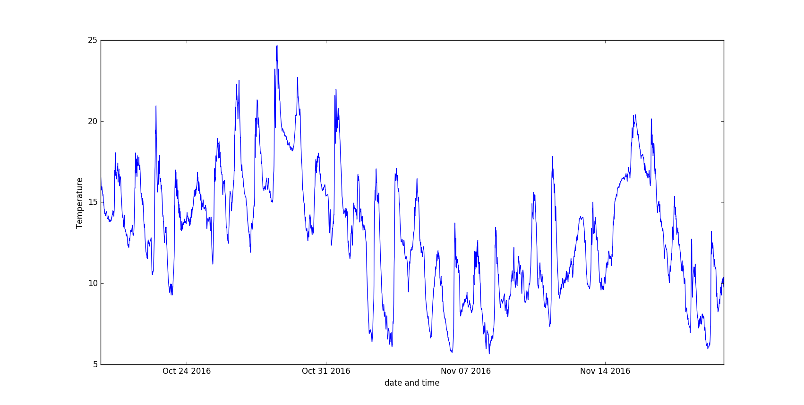

## Finishing off with a graph

You can now use the same code from Worksheet One to produce a graph of your data. Your list comprehensions will need to be a little different this time, as you're looking at extracting the temperatures and timestamps from the giant `data` list.

Your entire script should then look something like this:

``` python
from requests import get
import matplotlib.pyplot as plt
from dateutil import parser

url = 'https://apex.oracle.com/pls/apex/raspberrypi/weatherstation/getallmeasurements/490722'

pages = 1
weather = get(url).json()
data = weather['items']

while 'next' in weather and pages < 9:    
    url = weather['next']['$ref']
    print('Fetching {0}'.format(url))
    weather = get(url).json()
    data += weather['items']
    pages += 1

temperatures = [record['ambient_temp'] for record in data]
timestamps = [parser.parse(record['reading_timestamp']) for record in data]

plt.plot(timestamps, temperatures)
plt.ylabel('Temperature')
plt.xlabel('date and time')
plt.show()
```



