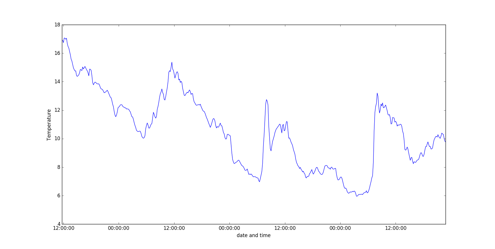

## Graphing the data

So far, your full code should look like this:

``` python
from requests import get
import matplotlib.pyplot as plt
from dateutil import parser

url = 'https://apex.oracle.com/pls/apex/raspberrypi/weatherstation/getallmeasurements/505307'

weather = get(url).json()

temperatures = [record['ambient_temp'] for record in weather['items']]
timestamps = [parser.parse(record['reading_timestamp']) for record in weather['items']]
```

- To graph the data, you only need three lines of code. The first will state the two sets of data you're plotting, and the second will display the data:

    ``` python
	## create a plot of timestamps against temperature and show it
    plt.plot(timestamps, temperatures)
    plt.show()
    ```

- Save and run your code, and a graph should be displayed.

- If you want to add labels to your axes, then you could add the an extra two lines:

    ``` python
    plt.plot(timestamps, temperatures)
	## Set the axis labels
    plt.ylabel('Temperature')
    plt.xlabel('Time')
    plt.show()
    ```



And now you have a graph showing temperature against time. Why not try and use some different sensor measurements, and see what your graph looks like?


